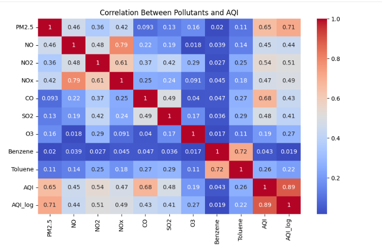
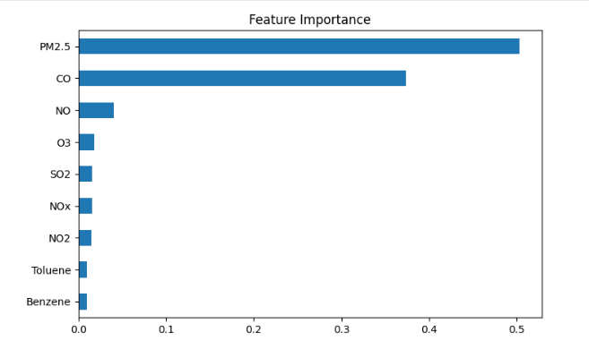
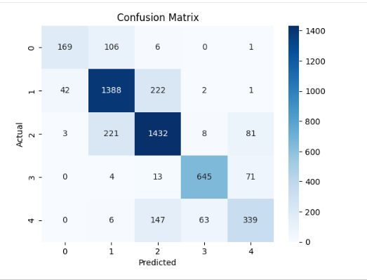
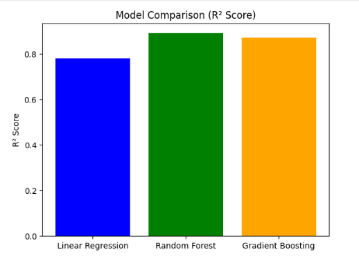

# Air Quality Index (AQI) Prediction using Machine Learning

## Overview
This project focuses on predicting the Air Quality Index (AQI) using machine learning techniques based on pollutant concentration data. It also analyzes key factors influencing air pollution and categorizes AQI levels for better understanding.

## Objectives
- Predict AQI using regression models
- Identify major pollutants affecting air quality
- Classify AQI into health-based categories
- Analyze seasonal trends in air pollution

## Dataset
The dataset contains daily air quality data from multiple cities, including pollutant concentrations such as PM2.5, NO2, CO, SO2, and others.

## Methodology
### Data Preprocessing
- Removed unnecessary and derived columns
- Handled missing values using appropriate techniques
- Dropped features with excessive missing data
### Exploratory Data Analysis
- Analyzed AQI distribution
- Studied correlations between pollutants
- Identified highly polluted cities
- Performed time-based (monthly) analysis
### Model Building (Regression)
- Linear Regression
- Random Forest Regressor
- Gradient Boosting Regressor
### Model Evaluation
- Compared models using R² Score and RMSE
- Random Forest achieved the best performance
### Feature Importance
- Identified PM2.5 and CO as major contributors to AQI

### Classification
- Converted AQI into categories (Good, Moderate, etc.)
- Built a Random Forest Classifier
- Evaluated using accuracy and confusion matrix

## Results
- Best Model: Random Forest Regressor
- R² Score: ~0.89
- Classification Accuracy: ~80%
- Strong influence of PM2.5 on AQI

## 📸 Visualizations
### Correlation Heatmap

### Feature Importance

### Confusion Matrix

### Model Comparison

## Key Insights
- AQI shows seasonal variation with higher levels in winter
- Particulate matter has a greater impact than gaseous pollutants
- Ensemble models outperform linear models

## Technologies Used
- Python
- Pandas, NumPy
- Matplotlib, Seaborn
- Scikit-learn

## Conclusion
This project demonstrates the use of machine learning to predict air quality and analyze environmental data. The results highlight the importance of key pollutants and show how data-driven insights can help understand pollution patterns.

## Future Improvements
- Deploy model using a web application
- Include real-time data integration
- Improve performance using advanced models
